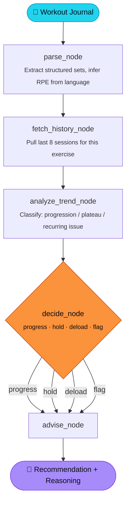

<div align="center">

# 🏋️ Repwise

**An AI training partner that reads your workout journal and coaches you — like a coach who actually remembers your last 8 sessions.**

[](https://www.python.org/)
[](https://www.langchain.com/langgraph)
[](https://www.langchain.com/)
[](https://ai.google.dev/)
[](https://docs.pydantic.dev/)
[](https://streamlit.io/)
[](https://www.sqlite.org/)
[](#license)

</div>

---

## 📖 What is this?

You write your workout the way you'd text a friend:

```
Bench press:
80kg x 8
80kg x 8
80kg x 7

Felt strong today. Last set was difficult but controlled.
```

Repwise turns that into structured data, pulls up your last 8 sessions for that
exercise, figures out whether you're **progressing, plateauing, or showing signs
of a recurring problem**, and then makes an actual training call —
**progress, hold, deload, or flag** — with a plain-language reason and a concrete
recommendation. No spreadsheets, no manual math, no guessing whether today's
session was actually harder than last week's.

It's not a chatbot wrapper. It's a small stateful agent with a real decision
pipeline, built to make one recurring judgment call well: **"what should I do
next session, based on everything that came before it?"**

---

## 🧠 How it thinks

Repwise is built as a **LangGraph** state machine — each step is a node, state
flows between them, and the final decision routes through a conditional edge
rather than a single giant prompt.



| Node | Responsibility |
|---|---|
| **`parse_node`** | Converts freeform journal text into a validated `WorkoutEntry` (exercise, sets, RPE, notes). RPE is *inferred from effort language* ("felt strong", "grinding") — never invented if the journal gives no signal. |
| **`fetch_history_node`** | Pulls the last 8 logged sessions for the same exercise from SQLite. |
| **`analyze_trend_node`** | Compares today's session against history and classifies the trend — no rigid numeric thresholds, judgment-based. |
| **`decide_node`** | The core decision: `progress`, `hold`, `deload`, or `flag` (safety first — pain/injury language always routes to `flag`). |
| **`advise_node`** | Turns the decision into a short, plain-language recommendation for the athlete. |

---

## ✨ Features

- 📝 **Freeform journal parsing** — write however you naturally would, no rigid format required
- 🎯 **Context-aware coaching** — decisions are based on *your* recent history, not generic rules
- 🚩 **Safety-first routing** — pain or injury language is always flagged over performance
- 📊 **Visual training history** — volume, max weight, and RPE trends over time per exercise
- 🏆 **PR tracking** — automatically flags when you match or beat an all-time best
- 🔥 **Streak tracking** — stay consistent, see it reflected back
- 💾 **Local-first storage** — SQLite, your data never leaves your machine unless you want it to

---

## 🏗️ Tech Stack

| Layer | Tool | Why |
|---|---|---|
| Orchestration | **LangGraph** | Stateful, branching workflow — not just a linear prompt chain |
| Model calls & structured output | **LangChain** | Structured Pydantic output straight from the LLM, no manual JSON parsing |
| Validation | **Pydantic** | Every piece of data crossing a node boundary is type-checked and validated |
| LLM | **Gemini (Flash family)** | Fast, cheap enough for a personal daily-use tool |
| Storage | **SQLite** | Zero-setup, file-based, perfect for a single-user tool |
| UI | **Streamlit** | Fast to iterate on, good enough for a real usable interface |
| Observability | **LangSmith** | Tracing for every node execution during development |

---

## ⚙️ Design decisions worth knowing about

<details>
<summary><b>Why LangGraph and not just a single prompt?</b></summary>
<br>
Because the "coaching" decision genuinely branches. A single prompt can't cleanly
separate "extract the data," "compare against history," "classify the trend," and
"make a safety-aware decision" — each of those needs different context, different
guardrails, and in the case of the decision step, needs to route differently
depending on the outcome. LangGraph makes that branching explicit instead of
smuggling it into one long prompt.
</details>

<details>
<summary><b>Why does RPE default to <code>null</code> instead of guessing?</b></summary>
<br>
Early testing showed the model would happily invent an RPE even when the journal
gave zero effort language. That's worse than no data — it's confidently wrong
data. The parse step is explicitly instructed to leave RPE as <code>null</code>
unless there's real evidence in the text, and the schema allows it.
</details>

<details>
<summary><b>Why does the app own the timestamp instead of the LLM?</b></summary>
<br>
The model occasionally hallucinated timestamps when the journal didn't mention
one. Timestamps are now optional in the schema and always set in application
code (<code>datetime.now()</code>) rather than trusted from model output.
</details>

<details>
<summary><b>Why not stack more frameworks for a longer buzzword list?</b></summary>
<br>
Deliberately avoided it. This project uses exactly the tools it needs — one
orchestration layer, one validation layer, one model provider — and each one
does real work. A project with five frameworks bolted on for keyword coverage
is easier to spot and less credible than one focused project that clearly does
something real.
</details>

---

## 🚀 Getting Started

### Prerequisites

- Python 3.11+
- A [Gemini API key](https://ai.google.dev/)

### Installation

```bash
# Clone the repo
git clone https://github.com/<your-username>/repwise.git
cd repwise

# Install dependencies
pip install -r requirements.txt
```

### Environment setup

Create a `.env` file in the project root:

```env
GEMINI_API_KEY=your_gemini_api_key_here
```

### Initialize the database

```python
# In db.py, uncomment and run once:
init_db()
```

### Run it

```bash
streamlit run app.py
```

---

## 📁 Project Structure

```
repwise/
├── app.py          # Streamlit UI — log workouts, view history
├── main.py         # LangGraph pipeline: parse → history → trend → decide → advise
├── models.py        # Pydantic schemas (WorkoutEntry, SetEntry, DecisionResult, TrendResult)
├── db.py            # SQLite storage layer
├── requirements.txt
└── .env             # (not committed) your API key lives here
```

---

## 🗺️ Roadmap

- [ ] Voice input via Whisper API — log a workout by talking, not typing
- [ ] WhatsApp bot front-end (Meta Cloud API) — log workouts without opening the app
- [ ] Multi-model fallback chain (currently single-model; designed to extend to a
      tiered fallback across model sizes for cost/latency tradeoffs)

---

<div align="center">
<sub>Built as a real training tool first, a portfolio project second.</sub>
</div>